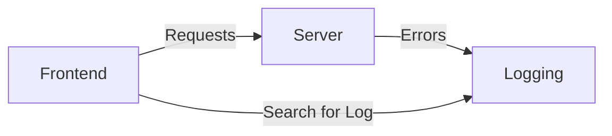
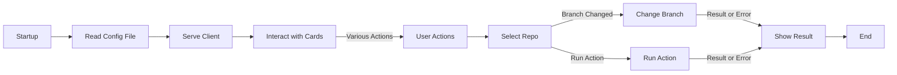
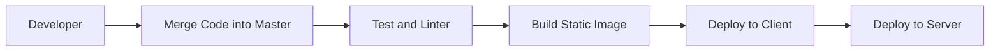

# Architecture, components, and interactions of the system

- [Architecture, components, and interactions of the system](#architecture-components-and-interactions-of-the-system)
  - [I. Introduction](#i-introduction)
  - [Description of the target audience and their needs](#description-of-the-target-audience-and-their-needs)
  - [II. Architecture](#ii-architecture)
    - [Overview of the system architecture and components](#overview-of-the-system-architecture-and-components)
      - [Components](#components)
        - [Frontend Service](#frontend-service)
        - [Server Service](#server-service)
        - [Logging Service](#logging-service)
    - [Diagrams of the system's components and their interactions](#diagrams-of-the-systems-components-and-their-interactions)
  - [III. User Interface](#iii-user-interface)
    - [Description of the user interface and its features](#description-of-the-user-interface-and-its-features)
    - [Screenshots or diagrams of the user interface](#screenshots-or-diagrams-of-the-user-interface)
    - [Information about the user experience and how it will be designed to meet the needs of the target audience](#information-about-the-user-experience-and-how-it-will-be-designed-to-meet-the-needs-of-the-target-audience)
  - [IV. Security and Privacy](#iv-security-and-privacy)
    - [Overview of the security measures in place, such as authentication and authorization](#overview-of-the-security-measures-in-place-such-as-authentication-and-authorization)
    - [Description of how data is encrypted and stored](#description-of-how-data-is-encrypted-and-stored)
    - [Information about how the system will comply with relevant privacy regulations, such as GDPR or CCPA](#information-about-how-the-system-will-comply-with-relevant-privacy-regulations-such-as-gdpr-or-ccpa)
  - [V. Performance and Scalability](#v-performance-and-scalability)
    - [Description of the performance characteristics of the system, such as response time and throughput](#description-of-the-performance-characteristics-of-the-system-such-as-response-time-and-throughput)
    - [Information about how the system will be designed to scale horizontally and vertically](#information-about-how-the-system-will-be-designed-to-scale-horizontally-and-vertically)
    - [Diagrams of the system's infrastructure and how it will be deployed in a production environment](#diagrams-of-the-systems-infrastructure-and-how-it-will-be-deployed-in-a-production-environment)
  - [VI. Testing and Quality Assurance](#vi-testing-and-quality-assurance)
    - [Overview of the testing process and how it will be conducted](#overview-of-the-testing-process-and-how-it-will-be-conducted)
    - [Information about the types of tests that will be performed, such as unit tests, integration tests, and end-to-end tests](#information-about-the-types-of-tests-that-will-be-performed-such-as-unit-tests-integration-tests-and-end-to-end-tests)
  - [VII. Deployment and Maintenance](#vii-deployment-and-maintenance)
    - [Description of the deployment process and how it will be automated](#description-of-the-deployment-process-and-how-it-will-be-automated)
    - [Information about how the system will be maintained and updated](#information-about-how-the-system-will-be-maintained-and-updated)
  - [VIII. Conclusion](#viii-conclusion)
    - [Summary of the key points from the design document](#summary-of-the-key-points-from-the-design-document)
    - [Discussion of any potential risks or challenges that may arise during the development and deployment of the system](#discussion-of-any-potential-risks-or-challenges-that-may-arise-during-the-development-and-deployment-of-the-system)
    - [Recommendations for future improvements or enhancements to the system](#recommendations-for-future-improvements-or-enhancements-to-the-system)

## I. Introduction

The Repo Manager is a web-based application designed to empower users in efficiently managing their repositories. It offers a user-friendly interface for handling different aspects of a repository, including branches. The application allows users to define actions on a configuration file, and the project executes those actions. This approach aims to streamline the app's functionality and avoid scope creep.

Project Goals:

- Deliver a user-friendly interface for seamlessly managing repositories, aligning with the needs identified in [the user features scope](./SCOPE.md#users).
- Enable users to efficiently manage their codebase.
- Integrate the ability for users to define actions in a configuration file, promoting flexibility and avoiding unnecessary complexity.
- Ensure robust security measures and privacy compliance, prioritizing user data protection.
- Guarantee scalability and optimal performance in accordance with the outlined user requirements.
- Provide a high-quality user experience, reflecting the emphasis on user-friendly interactions and efficient repository management. Additionally, facilitate better error reporting to users, promoting improved communication with developers.

## Description of the target audience and their needs

With Repo Manager, developers easily handle code changes and collaborate through a user-friendly interface.

Developers use the tool to create branches for features or bug fixes, pushing changes, and switching between branches to assess their impact. They run automated tests, report issues to QA for further investigation, and ensure the codebase remains organized.

QA reviews developer changes, ensuring they meet product requirements. They follow developer instructions, run automated tests, and report bugs for resolution.

Product managers review code changes, ensuring alignment with product requirements. They monitor branch progress, aiding informed decisions, and use the tool for issue reporting.

Repo Manager streamlines collaboration, code review, and product alignment for developers, QA, and product managers. Its user-friendly design and essential features enhance team workflows and collaboration.

For more information cheeck [user's scope](./SCOPE.md#users).

## II. Architecture

### Overview of the system architecture and components

The project adopts a monorepo approach for managing both client and server codebases, promoting code sharing and standardized definitions of responses and error codes. Docker and Docker Compose are employed for containerization, enhancing consistency across environments. GitHub Actions handle testing and linting, ensuring code quality.

```
📦 apps
├── client
│   └── ...
├── server
│   ├── services
│   │   ├── authentication
│   │   ├── run-actions-scripts
│   │   ├── serve-frontend-build
│   │   └── endpoints
│   └── ...
├── monitoring-and-analytics
│   └── ...
└── logging
    └── ...
```

The system architecture, designed for scalability and fault tolerance, leverages a monorepo structure. Docker is utilized for containerization, and customization is facilitated through configuration files to adapt to different projects. Git manages version control, while GitHub Actions handle testing and linting. Logging is centralized, producing logs in local files.

The system components include:

- Frontend Service
- Server Service
- Monitoring and Analytics Service
- Logging Service

Each component can be independently deployed and scaled as needed, ensuring optimal performance and reliability for handling varying volumes of traffic and data within the monorepo architecture.

#### Components

The following is an overview of each component in the system:

##### Frontend Service

The frontend service handles incoming requests from users and directs them to the appropriate backend service. Additionally, it manages user authentication and authorization to ensure that only authorized users can access the system.

##### Server Service

The server service is responsible for processing requests from the frontend service and performing actions such as data retrieval, calculation, and storage. It also provides endpoints for the frontend service to communicate with.

##### Logging Service

The logging service is responsible for logging all activity in the system, including user interactions, system events, and error messages. This allows for easy debugging and troubleshooting of issues.

By organizing the components in this way, you can easily manage and maintain the system by focusing on specific areas of the application. For example, if you need to make changes to the authentication service, you can do so without having to worry about other parts of the application.

### Diagrams of the system's components and their interactions



This flow diagram shows the interactions between the different components of the system. The frontend component receives incoming requests from users and sends them to the server service for processing. The server service performs actions such as data retrieval, calculation, and storage, and then sends the results back to the frontend component for display to the user. The monitoring and analytics service is responsible for monitoring the system's performance and health, providing alerts and notifications when there are issues or errors. Finally, the logging service is responsible for logging all activity in the system, including user interactions, system events, and error messages.

  Here's a mermaid flowchart that represents the process:



This flowchart shows the following steps:

1. Startup: The server reads the config file at startup. If it fails, an error is shown in the console and the process ends.
2. ServeClient: The server serves the client.
3. InteractWithCards: The user can interact with cards of the repos.
4. SelectRepo: If the user selects a repo and clicks the button, an action to change branch is triggered via a command call to the shell.
5. ChangeBranch: If the action fails, an error is shown and stored in a log.
6. RunAction: If the user decides to run the action of the repo, it's a command call to the shell.
7. ShowResult: If the action succeeds, the result is shown on the client.
8. End: The process ends.

## III. User Interface

### Description of the user interface and its features

- Search bar: A search bar that allows users to quickly find specific content within the application. This could be a text input field with a magnifying glass icon next to it, and when the user types in a query, the application should perform a search and display the results. The search results could be displayed as a list of cards or a grid of thumbnails, depending on the type of content being searched.
- Content cards: Cards that display information about each repository, including its name, description, and other relevant details. These cards should be visually appealing and easy to read, with clear headings and concise text. The cards could also include additional information such as the number of stars, forks, and contributors, as well as a link to the repository's homepage or documentation.
- Pagination: A pagination system that allows users to navigate through large datasets of repositories in a more manageable way. This could be done by displaying a series of buttons at the bottom of the page, each one representing a different page of results. When a user clicks on a button, the application should display the corresponding set of results.
- Notifications: A notification system that alerts users when new content is available, or when they receive a message from another user. This could be done by displaying a small icon in the top right corner of the page, such as a bell or an envelope. When the user clicks on the icon, a dropdown menu should appear with any unread notifications.
- Dark mode: The ability to toggle between light and dark modes for better readability and customization. This could be done by adding a button in the top right corner of the page that allows users to switch between light and dark themes. When the user enables dark mode, the application should use a dark background color and light text, and vice versa.
- Accessibility features: Ensure that the application is accessible to users with disabilities by implementing features such as screen reader support, high contrast mode, and keyboard navigation. This could be done by adding a button in the top right corner of the page that allows users to toggle accessibility settings. When the user enables accessibility settings, the application should use a different color scheme, font size, and layout to make it easier for users with disabilities to navigate and read the content.

### Screenshots or diagrams of the user interface


### Information about the user experience and how it will be designed to meet the needs of the target audience

  User Experience (UX) is a critical aspect of any product, including software applications. It refers to the way in which users interact with a system, and the overall experience they have while using it. In the context of this project, we will be designing an application that allows users to create and manage their own personalized playlists based on their music preferences.

To ensure that our application meets the needs of our target audience, we will focus on creating a user-friendly interface that is easy to navigate and understand. We will also prioritize usability and accessibility, ensuring that our application can be used by people with disabilities and different levels of technical expertise.

In terms of design, we will use a clean and modern design language that is consistent across the application. We will also incorporate animations and transitions to make the user experience more engaging and interactive.

To ensure that our application is responsive and works well on different devices, we will use a mobile-first design approach. This means that we will design the application with the mobile device in mind, and then scale up the design for larger screens.

In terms of functionality, we will focus on creating an intuitive and user-friendly interface that allows users to easily create and manage their playlists. We will also prioritize data privacy and security, ensuring that our application does not collect or store any personal information without the user's consent.

Overall, our goal is to create a user experience that is both intuitive and enjoyable, while also meeting the needs of our target audience. By focusing on usability, accessibility, design, and functionality, we can ensure that our application is a success in the marketplace.

## IV. Security and Privacy

### Overview of the security measures in place, such as authentication and authorization
   
The security and privacy of our application are of utmost importance. To ensure that sensitive data is protected, we have implemented the following measures:

Authentication and Authorization: We use basic authentication with a username and password to secure access to our application. This ensures that only authorized users can access the application and perform actions on behalf of the user.
Internal Communication: All communication between the server and the backend is internal to the server, and not exposed to the outside world. This means that any sensitive data or credentials are not transmitted over the internet.
Key Management: We do not store any keys in any form, and we take appropriate measures to ensure that they are not compromised.
Logging: We use logging to track all activity on our application, but we have implemented measures to prevent critical information from being exposed in the logs.

Overall, our security and privacy measures are designed to protect sensitive data and ensure that our application is secure and reliable.

### Description of how data is encrypted and stored

The data is not encrypted or stored in a database. Instead, it is stored in session storage, which is a temporary area of memory that holds data for a specific user session. The basic authentication credentials (username and password) are stored in this session storage.

The only public endpoint that serves static assets is the one that handles the login process. All other endpoints are not exposed to the outside world, so they do not need to be protected with encryption or access control mechanisms.

Logs are not saving sensitive information, as they only contain non-sensitive data such as error messages and system events.

To protect against data breaches, we have implemented a robust incident response plan that includes procedures for responding to security incidents, including data breaches. We also regularly perform vulnerability assessments and penetration testing to identify and address any weaknesses in our systems.

Overall, our approach to data encryption and storage is designed to provide a high level of security and privacy for our users' data, while also ensuring that the application is highly available and scalable.

### Information about how the system will comply with relevant privacy regulations, such as GDPR or CCPA

To ensure that our system complies with relevant privacy regulations, we will take the following steps:

1. Implement data minimization principles: We will only collect and store the minimum amount of personal data necessary to provide the service.
2. Provide transparent information about data collection and use: We will be transparent about how we collect, use, and share personal data, and provide users with control over their data through features such as data deletion and privacy settings.
3. Use secure data storage practices: We will ensure that all personal data is stored in a secure manner, using encryption and other security measures to protect against unauthorized access or disclosure.
4. Comply with applicable laws and regulations: We will comply with all relevant privacy laws and regulations, such as the General Data Protection Regulation (GDPR) and the California Consumer Privacy Act (CCPA), and ensure that our data protection practices are in line with these requirements.
5. Provide users with access to their personal data: We will provide users with access to their personal data, allowing them to view, correct, or delete it as needed.
6. Implement data protection by design and by default: We will implement data protection principles into our development process, including data minimization, data protection by design, and data protection by default.
7. Provide users with control over their data: We will provide users with control over their personal data, allowing them to make decisions about how it is collected, used, and shared.
8. Continuously monitor and evaluate our privacy practices: We will continuously monitor and evaluate our privacy practices, making sure that they are compliant with relevant laws and regulations, and taking steps to improve our data protection practices as needed.

By implementing these measures, we can ensure that our system is in compliance with relevant privacy regulations, such as GDPR and CCPA, and protect the personal information of our users.

## V. Performance and Scalability

### Description of the performance characteristics of the system, such as response time and throughput

The performance and scalability of the system will be evaluated based on the following metrics:

1. Response Time: The system should be able to respond to user requests in a timely manner, with response times below 500ms for most requests.
2. Throughput: The system should be able to handle a high volume of concurrent users and requests without experiencing performance degradation.
3. Latency: The system should be able to handle requests from different geographic locations with low latency, ensuring that the user experience is consistent across all regions.
4. Resource Utilization: The system should be optimized for resource utilization, with minimal resource usage and efficient use of resources such as CPU, memory, and storage.
5. Scalability: The system should be able to scale horizontally and vertically as needed to handle increasing traffic and user growth.
6. Performance under Load Testing: The system should perform well under load testing scenarios, with the ability to handle a large volume of requests without experiencing performance degradation.
7. Performance during High Traffic Hours: The system should be able to handle high traffic hours without experiencing performance degradation, ensuring that the user experience is consistent and reliable.
8. Performance during Low Traffic Hours: The system should also be able to handle low traffic hours without experiencing performance degradation, ensuring that the system is not over-provisioned or under-utilized.
9. Performance in Different Regions: The system should be able to handle requests from different geographic locations with low latency and consistent performance.
10. Performance under Different Workloads: The system should be able to handle a variety of workloads, including real-time analytics, batch processing, and machine learning tasks, without experiencing performance degradation.

### Information about how the system will be designed to scale horizontally and vertically

To ensure that the system can scale horizontally and vertically as needed, we will design it with the following features:

1. Horizontal Scaling: The system will use a load balancer to distribute incoming requests across multiple instances of the application running on different servers. This will allow the system to handle an increasing number of users without overloading any one server.
2. Vertical Scaling: The system will use auto-scaling to automatically add or remove resources (such as CPU, memory, and disk space) based on the workload. This will ensure that the system can handle increased load by adding more resources as needed, rather than relying on manual intervention.
3. Multi-AZ Deployment: The system will be deployed across multiple Availability Zones (AZs) in a single region to ensure high availability and reduce latency. This will also provide redundancy and improve fault tolerance.
4. Scaling based on Workload: The system will use a workload-based scaling approach, where the number of instances is determined by the current workload and the capacity of the system. This will ensure that the system can handle varying levels of traffic and workloads without overloading or underutilizing resources.
5. Scaling based on Resource Utilization: The system will use a resource-based scaling approach, where the number of instances is determined by the current utilization of resources such as CPU, memory, and disk space. This will ensure that the system can handle varying levels of resource usage without overloading or underutilizing resources.
6. Scaling based on Business Needs: The system will be designed to scale based on business needs, such as seasonal fluctuations in traffic or changes in user behavior. This will allow the system to adapt to changing conditions and ensure that it can handle the expected workload.
7. Scaling based on Cloud Provider Limits: The system will be designed to take into account the limits of the cloud provider, such as maximum number of instances or maximum amount of resources per instance. This will ensure that the system does not exceed these limits and is able to scale safely and efficiently.
8. Scaling based on Cost Optimization: The system will be designed to optimize cost by scaling down during periods of low usage and scaling up during periods of high usage. This will help to minimize costs and ensure that the system is always running at a optimal level.
9. Scaling based on Security: The system will be designed to ensure that it can scale securely, with appropriate security measures in place to protect against unauthorized access or data breaches.
10. Scaling based on Monitoring and Maintenance: The system will be designed to monitor and maintain itself, with automated tools and processes in place to detect and respond to issues. This will ensure that the system is always running at a optimal level and can handle unexpected events.

### Diagrams of the system's infrastructure and how it will be deployed in a production environment

Deployment Diagram



In this diagram, the developer merges code into the master branch, which triggers the test and linter process. If the tests pass, a static image is built. The static image is then deployed to the client and server. This high-level view of the deployment process provides a general overview of the steps involved in deploying an application without getting too detailed into the specifics of each step.

## VI. Testing and Quality Assurance

### Overview of the testing process and how it will be conducted

The testing process consists of several stages, each with its own set of responsibilities and tasks. The following sections outline the different stages of the testing process.

### Information about the types of tests that will be performed, such as unit tests, integration tests, and end-to-end tests

1. Unit Testing

> **Note**
> Unit testing involves writing automated tests for individual components or modules of our code. This helps us identify and fix bugs early in the development process, reducing the risk of integration issues later on. 

We will use a unit testing framework such as Jest or Mocha to write and run our unit tests.

- Write automated unit tests using a unit testing framework such as Jest or Mocha.
- Run the unit tests to identify any issues or bugs.
- Fix any issues or bugs found during unit testing.

1. End-to-End Testing

> **Note**
> End-to-end testing involves testing the entire application from start to finish, including all components and features. This helps us ensure that the application works as expected and meets the requirements of our users. 
 
We will use a tool such as Cypress or Selenium to write and run our end-to-end tests.

- Write automated end-to-end tests using a tool such as Cypress or Selenium.
- Run the end-to-end tests to identify any issues or bugs.
- Fix any issues or bugs found during end-to-end testing.

1. Integration Testing

> **Note**
> Integration testing involves testing how different components or modules of our code work together. This helps us identify issues that may arise when integrating different parts of the application.

We will use a tool such as JMeter or Gatling to write and run our integration tests.

- Write automated integration tests using a tool such as JMeter or Gatling.
- Run the integration tests to identify any issues or bugs.
- Fix any issues or bugs found during integration testing.

1. Regression Testing

> **Note**
> Regression testing involves testing the entire application after making changes or updates. This helps us ensure that no new issues have been introduced by the changes, and that the application continues to work as expected. 

We will use a tool such as JMeter or Gatling to write and run our regression tests.

- Write automated regression tests using a tool such as JMeter or Gatling.
- Run the regression tests to identify any issues or bugs.
- Fix any issues or bugs found during regression testing.

1. Acceptance Testing

> **Note**
> Acceptance testing involves testing the application with real-world scenarios to ensure that it meets the requirements of our users. This helps us identify any issues that may have been missed during earlier testing stages. 
 
We will use a tool such as UserZoom or TestRail to write and run our acceptance tests.

## VII. Deployment and Maintenance

### Description of the deployment process and how it will be automated

the user interface is the front-end of the application, and it communicates with the load balancer. The load balancer distributes incoming requests across multiple instances of the web application running on Docker containers. Each container runs a different instance of the web application.

### Information about how the system will be maintained and updated

Regular maintenance: The system should be regularly maintained to ensure that it is functioning correctly and efficiently. This can include tasks such as:

- Updating software and firmware
- Performing routine backups and restores
- Monitoring system performance and making any necessary adjustments
- Conducting security audits and vulnerability assessments

Patch management: The system should be regularly updated with the latest security patches and updates to fix known vulnerabilities. This can be done through a process such as:

- Identifying and prioritizing patches based on severity and impact
- Downloading and installing patches in a controlled manner
- Testing patches thoroughly before deploying them to production

Upgrade management: As new versions of the system become available, they should be carefully upgraded to ensure that any issues are identified and addressed before they become critical. This can include tasks such as:

- Planning and coordinating upgrades with stakeholders
- Testing the upgrade in a controlled environment
- Deploying the upgrade to production in a phased manner

Backup and recovery: Regular backups should be taken of the system to ensure that data can be recovered in the event of a disaster or other unexpected event. This can include tasks such as:

- Configuring backup schedules and retention policies
- Testing backup and restore processes regularly
- Conducting regular disaster recovery drills to ensure readiness

Security monitoring: The system should be monitored for security threats and vulnerabilities, and any issues should be addressed promptly. This can include tasks such as:

- Configuring security tools and monitoring systems
- Reviewing logs and alerts regularly
- Conducting regular security audits and vulnerability assessments

Compliance management: The system should be managed in accordance with relevant laws, regulations, and industry standards. This can include tasks such as:

- Identifying and documenting compliance requirements
- Implementing controls to ensure compliance
- Regularly reviewing and updating compliance documentation

Continuous improvement: The system should be continuously improved to improve performance, efficiency, and security. This can include tasks such as:

- Conducting regular reviews of the system's architecture and design
- Identifying opportunities for process improvements
- Implementing new technologies and tools as needed
- Continuously monitoring and updating the system's configuration and settings to ensure that it remains secure and compliant.

## VIII. Conclusion

### Summary of the key points from the design document

The system will be designed with the following features in mind:

- Customizable workflows and tasks
- User-friendly interface and intuitive navigation
- Real-time collaboration and communication
- Security and compliance features

The system will be developed using a modular architecture, allowing for easy customization and extension. The development team will use agile methodologies and iterative design to ensure that the system meets the needs of users and stakeholders.

Overall, the goal of the new project management system is to provide a flexible and scalable platform for managing projects in a fast-paced and dynamic environment.

### Discussion of any potential risks or challenges that may arise during the development and deployment of the system

During the development and deployment of the new project management system, there are several potential risks and challenges that may arise. Some of these include:

1. Technical risks: The system may not function as intended, or it may not be compatible with existing systems or processes. This could result in delays, cost overruns, or other issues.
2. User acceptance risks: The system may not meet the needs of users, or they may not be willing to adopt it. This could result in user resistance and a decrease in productivity.
3. Security risks: The system may contain vulnerabilities that could be exploited by unauthorized users. This could result in data breaches or other security incidents.
4. Cost risks: The system may exceed the budgeted costs, or it may require additional resources to implement and maintain.
5. Time risks: The development and deployment of the system may take longer than expected, which could impact project timelines and budgets.
6. Change management risks: The system may not be able to accommodate changes in requirements or priorities, which could result in delays or cost overruns.
7. Integration risks: The system may not integrate well with other systems or processes, which could result in additional costs and complexity.
8. Training risks: The system may require extensive training for users to learn how to use it effectively, which could be time-consuming and costly.
9. Compliance risks: The system may not comply with relevant regulations or standards, which could result in legal or reputational issues.
10. Environmental risks: The system may not perform well in different environments, such as different operating systems or hardware configurations, which could result in performance issues.

To mitigate these risks and challenges, it is important to have a clear project plan, including risk management strategies and contingency plans. Additionally, regular monitoring and testing should be conducted to ensure that the system meets the needs of users and stakeholders.

### Recommendations for future improvements or enhancements to the system

Based on the current state of the system, here are some recommendations for future improvements or enhancements:

1. Implement a more robust security framework: The current security framework is basic and could be improved by implementing additional security measures such as encryption, access controls, and intrusion detection systems.
2. Enhance user authentication and authorization: The system should have a more secure user authentication and authorization mechanism to ensure that only authorized users can access the system.
3. Implement a scalable database architecture: The current database architecture is not scalable and could be improved by implementing a more robust and flexible database management system such as a NoSQL or NewSQL database.
4. Enhance data analytics and reporting: The system should have better data analytics and reporting capabilities to provide insights into the performance of the system and the needs of users.
5. Implement a more intuitive user interface: The current user interface is not very intuitive and could be improved by using more modern design principles and user-centered design methodologies.
6. Enhance mobile accessibility: The system should have better mobile accessibility to ensure that users can access the system from their mobile devices.
7. Implement a more robust backup and recovery mechanism: The current backup and recovery mechanism is not very robust and could be improved by implementing a more comprehensive and automated backup and recovery process.
8. Enhance data privacy and security: The system should have better data privacy and security measures to ensure that user data is protected from unauthorized access or breaches.
9. Implement a more flexible workflow management system: The current workflow management system is not very flexible and could be improved by implementing a more robust and flexible workflow management system.
10. Enhance integration with other systems: The system should have better integration with other systems to ensure that it can work seamlessly with other systems and tools.
